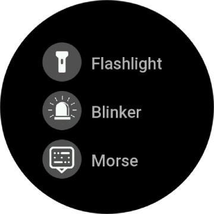
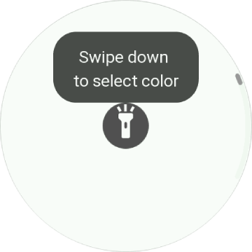
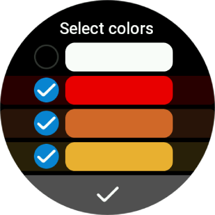
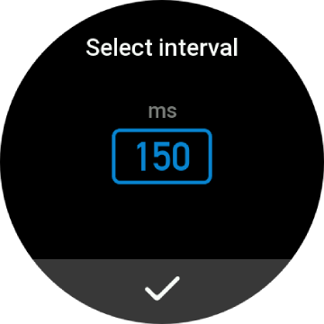
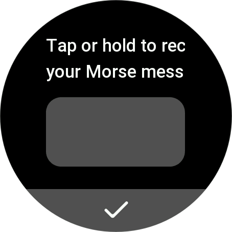

# Flashlight Application for [ZEPP OS](https://docs.zepp.com/docs/intro/) devices

## Table of Contents

1. [Disclaimer](#disclaimer)
2. [Description](#description)
3. [Quick start](#quick-start)
4. [Privacy Statement](#privacy-statement)
5. [Permissions](#permissions)

### Disclaimer
**⚠️ Warning ⚠️**

This application uses bright colors and rapid flashing lights. Some modes, such as the strobe and Morse code, may include frequent light flashes at short intervals.
If you have photosensitive epilepsy or other conditions triggered by flashing lights, please use this app with caution or avoid using it.
### Description

Service category: Common

App classification: Utilities

App introduction: Flashlight application with advanced features

GlowPro is a powerful and customizable flashlight for your Amazfit watch! Adjust brightness, color, and modes (steady light, strobe, Morse code) with an intuitive interface.

Turn your smartwatch into a versatile flashlight with customizable settings!
- 🔦 Steady Light – Choose color and brightness for continuous illumination.
- 🚨 Blinker Mode – Set colors and flashing intervals.
- 🆘 Morse Code – Send messages using light signals.

Key features: **#Colored flashlight** **#Customizable blinker** **#Morse** **#Easy to use**

#### Currently supported:
Devices with round or square screens, with Zepp OS 3.0 or higher 

##### Languages:

- en-US
- ru-RU

### Quick start
- Select mode

- Set color for flashlight

- Set colors and interval for blinker

 

- Record your Morse message

### Privacy Statement

We collect only device-specific information, such as the shape and size of your screen, to improve usability of the app.
We **do not collect** any personal information, and **do not share** any information with third parties.

We may make changes to this privacy statement from time to time. To stay up-to-date on the latest changes, please review this statement
periodically.

### Permissions

- Getting device info
